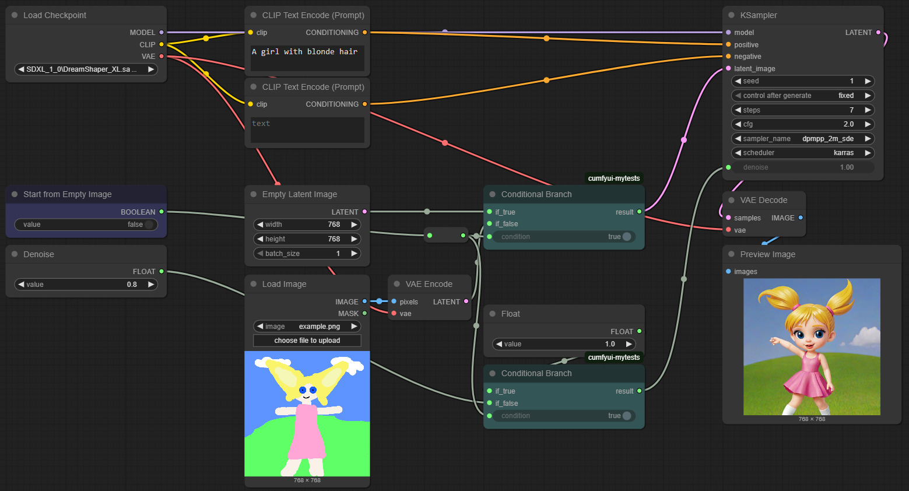
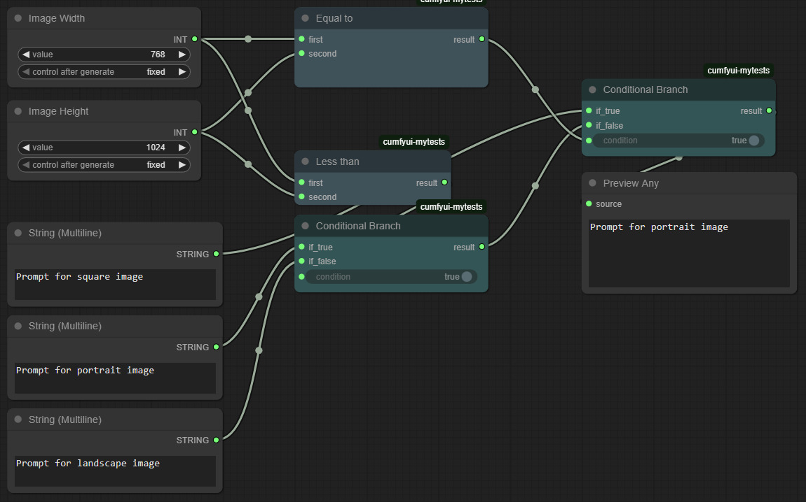

# ComfyUI Boolean Expressions
[](LICENSE)


[](https://github.com/marco-zanella/ComfyUI-BooleanExpression/actions/workflows/publish_action.yml)

A collection of **logic and comparison nodes** for [ComfyUI](https://github.com/comfyanonymous/ComfyUI).  
This package adds building blocks for boolean logic, arithmetic comparisons, and string comparisons, making it easier to design conditional workflows directly in ComfyUI.


## ✨ Features
- Boolean logic (`And`, `Or`, `Not`, etc.)  
- Arithmetic comparisons (`<`, `>`, `=`, …)  
- String comparisons (`contains`, `starts with`, `ends with`, …)  
- `Conditional Branch` (if–then–else logic flow)  
- Organized under **Boolean Expressions** category  
- Works with **booleans, numbers, and strings**  

Use these nodes to:
- Switch between inputs based on conditions.  
- Build parameterized prompts.  
- Compare numbers or strings dynamically.  
- Create reusable logical subgraphs.  


## 📦 Installation
### With [ComfyUI Manager](https://github.com/ltdrdata/ComfyUI-Manager)
1. Open ComfyUI Manager in your ComfyUI installation.  
2. Search for **ComfyUI-BooleanExpression**.  
3. Click **Install**.  

### Manual install
Clone this repository into your `custom_nodes` folder:

```bash
cd ComfyUI/custom_nodes
git clone https://github.com/marco-zanella/ComfyUI-BooleanExpression.git
```

Restart ComfyUI, and the nodes will appear under the Boolean Expressions category.


## 📸 Examples
### Conditional Latent Image
This workflow demonstrates how a boolean toggle can control whether generation begins from an empty latent image or from a selected input image converted into latent space. Two `Conditional Branch` nodes manage the logic: the first selects which latent image to use, while the second determines the correct denoise factor, applying a user-defined value when starting from an existing image and defaulting to `1.0` when starting from an empty latent.


[Download this workflow](doc/workflows/conditional-latent-image.json)

### Conditional Format Prompt
This workflow demonstrates how to automatically select prompts optimized for square, portrait, or landscape images based on the configured width and height. Arithmetic comparison nodes (`Equal to` and `Less than`) determine the image’s aspect ratio, and two `Conditional Branch` nodes then return the appropriate prompt.


[Download this workflow](doc/workflows/conditional-format-prompt.json)


## 🔧 Detailed Node List
### Boolean Logic
- False
- True
- Not
- And
- Or
- Xor
- Nand
- Nor
- Binary Expression
- Conditional Branch (if–then–else)

### Arithmetic Comparison
- Less than
- Less than or equal to
- Equal to
- Not equal to
- Greater than or equal to
- Greater than
- Binary Comparison

### String Comparison
- Comes before (alphabetical less than)
- Comes before or equal to
- Equal to
- Not equal to
- Comes after or equal to
- Comes after
- Contains
- Does not contain
- Starts with
- Does not start with
- Ends with
- Does not end with
- String Comparison